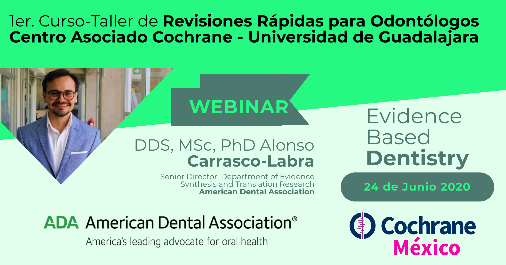

## Bienvenidos al 1er Curso-Taller a distancia de Revisiones Rápidas

## Sesión 1 (19/06/2020):

Este curso es un esfuerzo realizado por la Universidad de Guadalajara, Cochrane México y la American Dental Association, dentro de los principales objetivos de este curso es el informar a los asistentes respecto a la evidencia disponible de utilidad para resolver preguntas pertinentes en el área de la odontología, las preguntas que no pudieran ser contestadas con la información ya disponible de revisiones sistemáticas y síntesis de evidencia, se ofrecerán las herramientas y el acercamiento metodológico para la búsqueda y elaboración de revisiones rápidas. 

Ligas de interés: 

https://ebd.ada.org/en 

https://methods.cochrane.org/rapidreviews/welcome 

https://covidrapidreviews.cochrane.org/ 

https://es.epistemonikos.cl/frisbees-mensuales/ 

*OBJETIVO DE LA SESIÓN:* Identificar los elementos claves de una revisión rápida y diferenciar los métodos de una revisión sistemática, los alcances y las limitaciones de adoptar este método. 

## Sesión 2 (24/06/2020):

## Sesión 3 (26/06/2020):

## Sesión 4 (01/07/2020):

## Sesión 5 (03/07/2020):

## Sesión 6 (08/07/2020):
